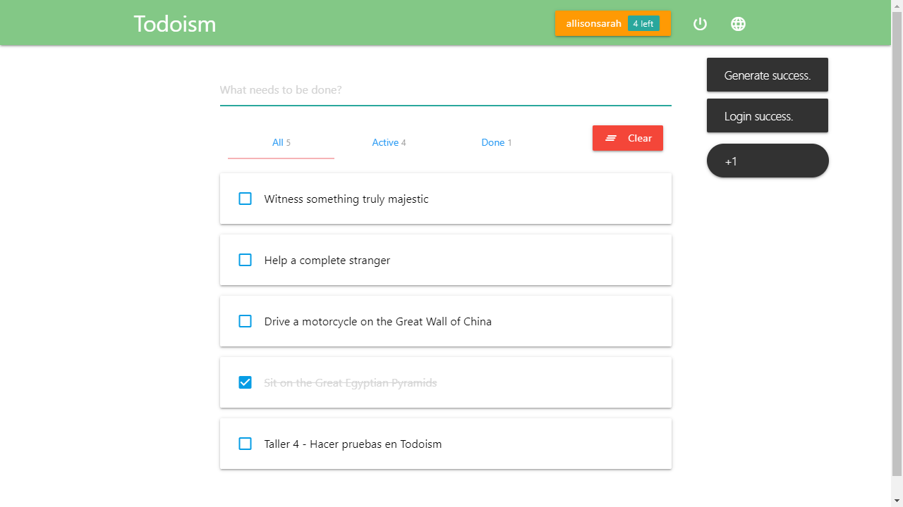
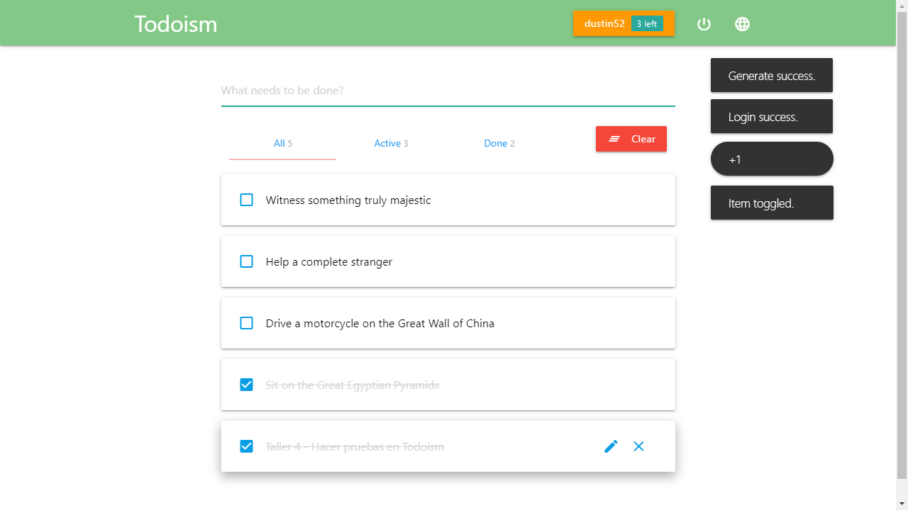
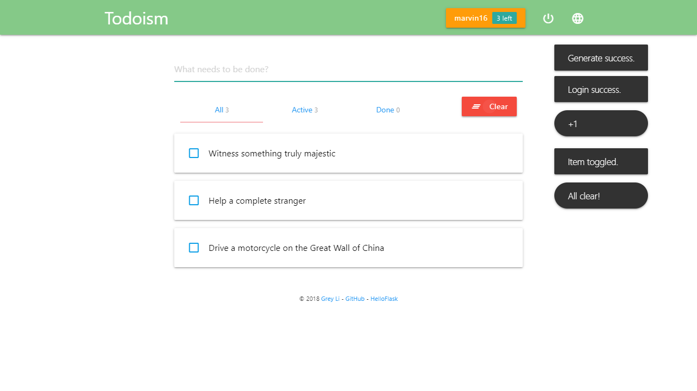

# taller-playwright-todoism

Este repositorio resuelve el taller4 de automatización de pruebas para Todoism utilizando Playwright, para completar la actividad realizada en clase: sesiones 6-7 del curso de Testing en EAFIT.

## Reto planteado

El propósito de este proyecto es utilizar las capacidades de Playwright para automatizar una suite de pruebas con 3 pruebas independientes que validen el éxito de la ejecución.

## Estructura del proyecto

- *Configuración de Playwright*:
  - [playwright.config.ts](playwright.config.ts)
- *Datos de la tarea a crear*:
  - [todoism-task.data.ts](data/todoism-task.data.ts) 
- *Páginas, en conformidad con el patrón POM*:
  - [pages/intro.page.ts](pages/intro.page.ts)
  - [pages/login.page.ts](pages/login.page.ts)
  - [pages/app.page.ts](pages/app.page.ts)
- *Especificación del caso de pruebas - Crear un equipo*:
  - [tests/todoism-test-suite.spec.ts](tests/todoism-test-suite.spec.ts)

## Orden de la ejecución del caso de prueba

Se realizaron los siguientes pasos en la especificación de la suite de pruebas `Todoism Test Suite`:

I. En el *hook* `BeforeEach`, se genera el usuario aleatorio y realizamos el ingreso al app.

Luego se ejecutan las tres pruebas

### Crear tarea

1. Crear task
2. **Realizar la aserción para validar que la tarea está creada**
3. _Tomar la evidencia en imagen_

### Completar tarea

1. Completar task
2. **Realizar la aserción para validar que la tarea está completada**
3. _Tomar la evidencia en imagen_

### Limpiar tarea

1. Limpiar todas las completed tasks
2. **Realizar la aserción para validar que la tarea completada ha sido borrada**
3. _Tomar la evidencia en imagen_

## Presentación de evidencias de ejecución exitosa

  

    
Task created

    
  

  

    
Task completed

    
  

  

    
Task cleared

    
  

## Instalación y ejecución de la prueba

Para ejecutar el caso de prueba, realiza los siguientes pasos:
1. *Clona el proyecto*:
   `git clone <repo_url>`

2. *Instala las dependencias*:
   `npm install`

2. *Ejecuta las pruebas*:
   `npx playwright test` (Opcional el flag `--ui`)

3. *Verifica los resultados*:
   En cada ejecución de las pruebas, el reporte se genera en el directorio `playwright-report/.` Al interior de este, el archivo `index.html` se puede abrir para ver un informe detallado de las pruebas.

   Cada ejecución regenera las imágenes de evidencia en la carpeta `./evidences`

## Requisitos

- Node.js (versión 16 o superior)

## Autor

- Andrés Ayala <amayalac@eafit.edu.co>

## Licencia

Este proyecto es un trabajo académico y está bajo la licencia MIT. Consulta el archivo [LICENSE](LICENSE) para más detalles.